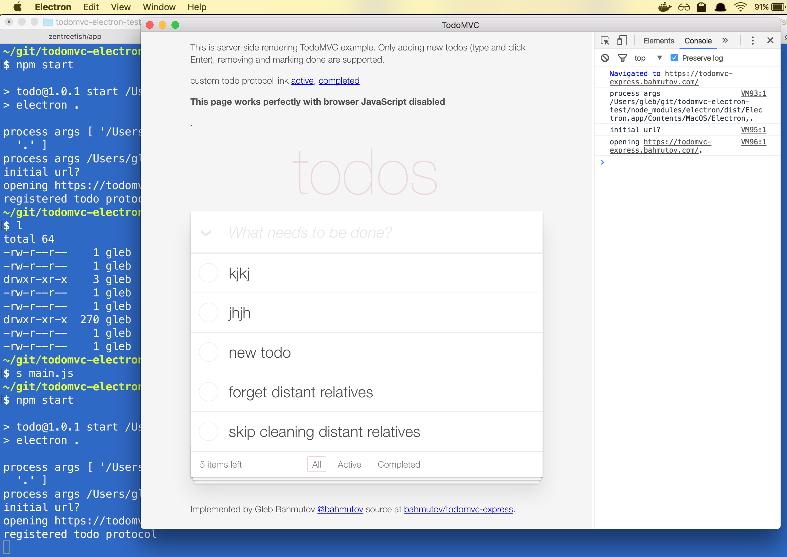
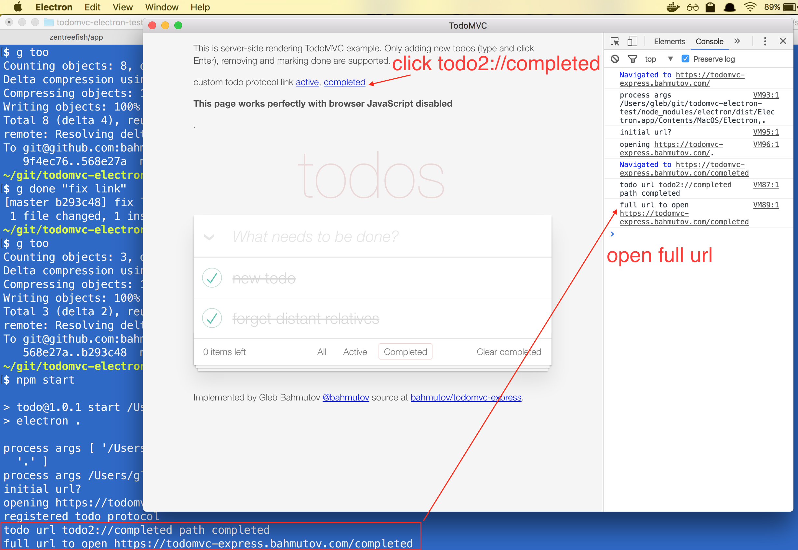
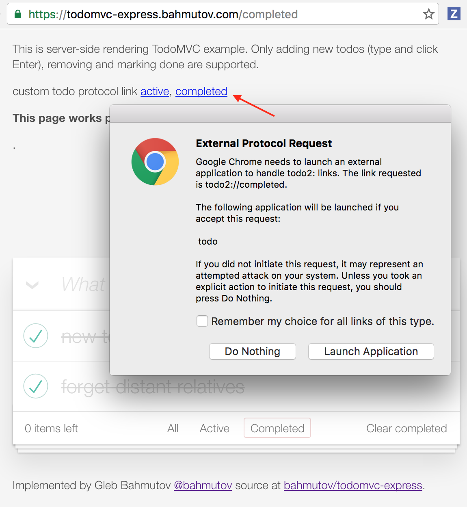

# todomvc-electron-test

This is a clone of [Electron quick start](https://github.com/electron/electron-quick-start)
project with added custom protocol support. Opens both internal and
external custom protocol links `todo2://<something>`. You can read how it is
done in [Electron app with custom protocol](https://glebbahmutov.com/blog/electron-app-with-custom-protocol/)
blog post.

## Internal links

Handles internal custom protocol links `todo2://<something>` found inside
the Electron app by redirecting them
to `https://todomvc-express.bahmutov.com/<something>`.

## External links

Clicking a `todo2://<something>` inside other applications (like Chrome)
also opens this application, if it has been installed via created Mac OS X
or Windows installer

#### License [CC0 1.0 (Public Domain)](LICENSE.md)
